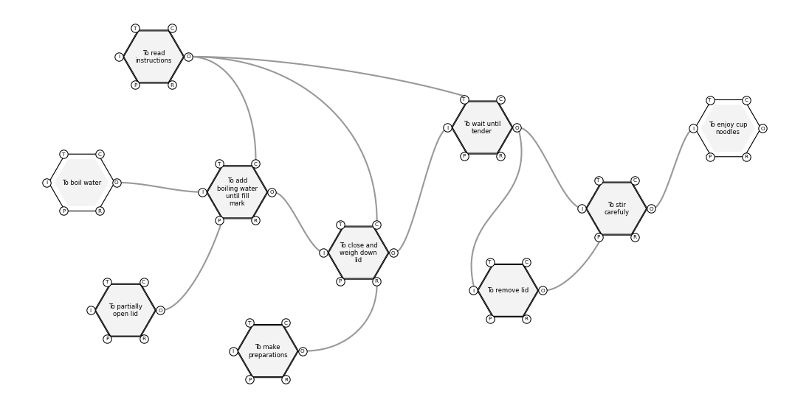
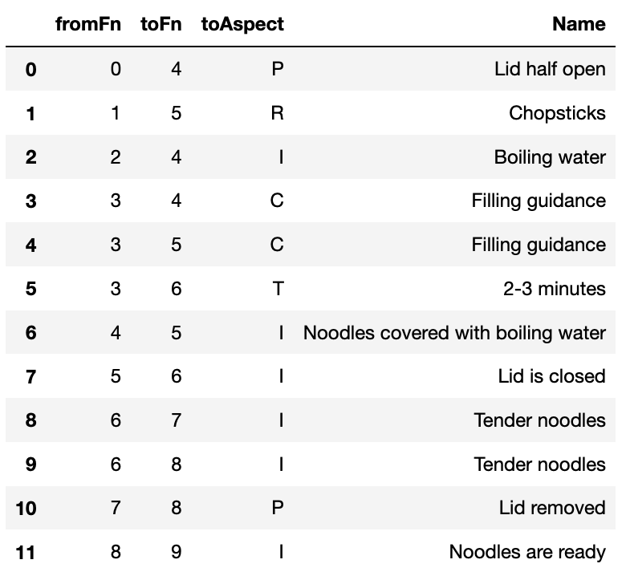
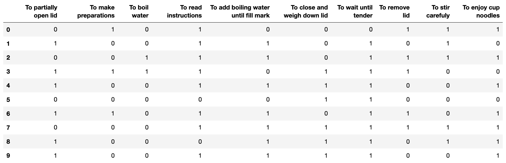
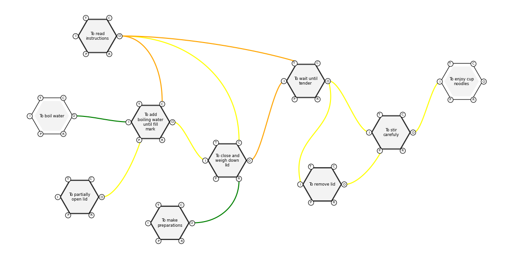

.. _example:

=============
Example Usage
=============

FRAM models can be loaded from `.xfmv` files. A FRAM object holds the model.

>>> import framalytics
>>>
>>> fram = framalytics.FRAM('Cup Noodles.xfmv')

Simple aggregate information about the model can be obtained.

>>> fram.number_of_functions()
 10

>>> fram.number_of_connections()
 12

The model can be visualized using the characteristics stored in the `.xfmv` file.

>>> fram.visualize()

Extracting Information
----------------------

All components of the FRAM model can be extracted, such as the list of functions or connections.

>>> fram.get_functions()
 {0: 'To partially open lid',
  1: 'To make preparations',
  2: 'To boil water',
  3: 'To read instructions',
  4: 'To add boiling water until fill mark',
  5: 'To close and weigh down lid',
  6: 'To wait until tender',
  7: 'To remove lid',
  8: 'To stir carefuly',
  9: 'To enjoy cup noodles'}

>>> fram.get_connections()

The function id and name originate from the `.xfmv` file, as does the connection name.

There are a variety of getter methods to retrieve information on individual functions, for
example, a list of functions connected to a particular aspect of the specified function.

>>> fram.get_function_outputs('To read instructions')
 {4: 'To add boiling water until fill mark',
  5: 'To close and weigh down lid',
  6: 'To wait until tender'}

Functions can be referred to by their name or id.

>>> fram.get_function_preconditions(4)
 {0: 'To partially open lid'}

For a full list of methods, consult the :ref:`api`.

Data Integration
----------------

Real data can also integrated into the visualization of the FRAM model to help understand
critical pathways through the model. The data must be defined either in terms of the functions
or connections that each observation touches.

>>> df

In this case, data is converted to a pandas DataFrame where the columns match the list of
functions. Each row is an observation of the data. If the observation involves a particular
function, then the value is 1, otherwise it is 0.

>>> fram.highlight_data(df)

This colours connections based on how many times they occur out of the total data set. Green is
least common, with yellow, orange and red connections appearing more frequently in the data.

Data can also be specified by the connections involved, rather than functions. Check the
:ref:`api` for more details on visualizing data, such as appearance styles and data formats.
